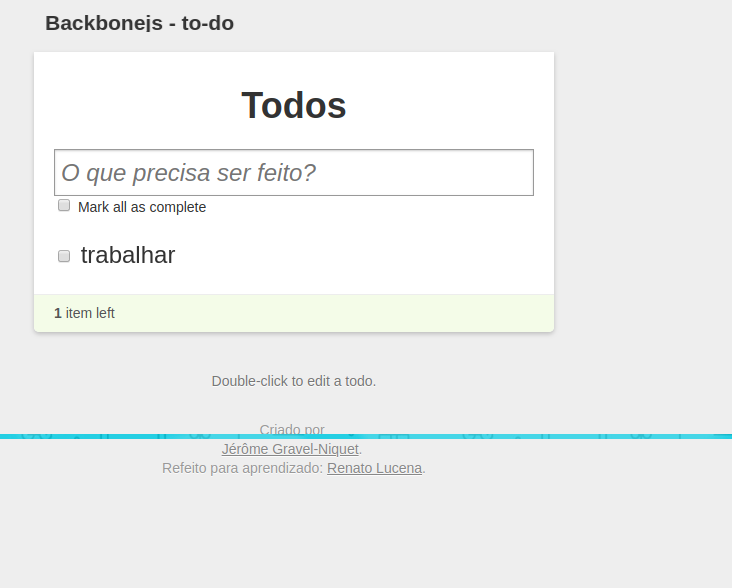

# introducao-ao-backbone-js

## Criando uma aplicação de to-do

- https://www.devmedia.com.br/introducao-ao-backbone-js/29303
- https://jgn.me/
- https://github.com/jeromegn

## Faça o download
- https://underscorejs.org/
- http://backbonejs.org/

> Nota: O código a seguir foi criado por Jerome Gravel-Niquet e está disponível também no GitHub e pode ser visualizado em: http://documentcloud.github.io/backbone/examples/todos/index.html

### Renato Lucena - 07/2018
